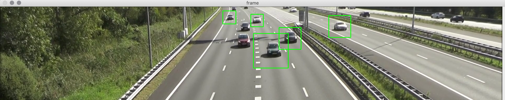

# Live Car Detection with OpenCV and Python

A computer vision-based system I made that implements a trained Haar cascade to detect vehicles.

I used [Dr. M. Santos's paper](Automatic_Detection_of_Cars_in_Real_Roads_using_Haar-like_Features.pdf) as a reference through the creation of this project. 

She explains a process that consists of using representative datasets for training and validation including positive and negative image samples.

**If you'd like more information on the actual science behind the model see the paper**

## Installation

I imported a pre-trained cascade model [car.xml](car.xml) file which saved time from having to train our model to spot cars in video frames.

The first thing you'll need to do is ```pip3 install opencv-python``` to install the OpenCV Python module cv2.

**Note**, you *can* use your own .mp4 file to test the code on once I finish it, **but I highly recommend using the .mp4 included in this repository.**

Next, head over to where you stored my code in your command line and execute the script using ```python3 script.py```

You should see something like this:



Since our render_cars() function recieves the video and draws rectangles around it using the haar-like coordinates specified in Dr. Santos's paper, it may be finnicky depending on the .mp4 file you use to test the code, but with a pre-trained model I wouldn't expect perfection.
